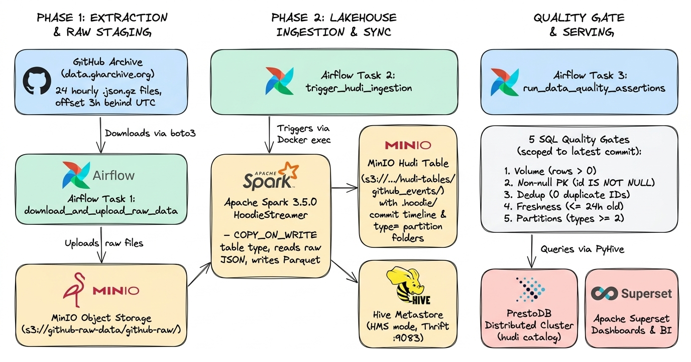

# Data Lakehouse on Docker: Presto · Apache Hudi · MinIO

A self-contained **data lakehouse** that runs entirely in Docker. It ingests the public
[GitHub Archive](https://www.gharchive.org/) event firehose into ACID-transactional
[Apache Hudi](https://hudi.apache.org/) tables on S3-compatible object storage, registers them in a
Hive Metastore, queries them with a distributed [PrestoDB](https://prestodb.io/) cluster, and
orchestrates the whole thing with [Apache Airflow](https://airflow.apache.org/) behind a
SQL-based data-quality gate.

<p align="center">
  
</p>

### Scope and honest limitations

This is a **learning and demonstration platform**, not a production deployment. Specifically:

- Airflow runs the `SequentialExecutor` against a **SQLite** database — one task at a time, no parallelism.
- Spark runs in **local mode** (`--master local[4]`) inside a single container. There is no Spark cluster,
  and therefore no executors — only a driver JVM.
- Every credential defaults to a well-known value (`admin`/`admin`, `minioadmin`/`minioadmin`).
- There is no authentication, TLS, or authorisation on any endpoint.
- Ingestion is **batch only**. There is no streaming or CDC path.
- The Avro schema is **fixed**, not self-evolving — see
  [Schema handling](#schema-handling-important) for exactly what that means.

Everything else below is verified against the running stack.

---

## Table of contents

- [Technology stack](#technology-stack)
- [How the pipeline works](#how-the-pipeline-works)
- [Repository layout](#repository-layout)
- [File-by-file reference](#file-by-file-reference)
- [Service-by-service reference](#service-by-service-reference)
- [Persistent volumes](#persistent-volumes)
- [Environment variables](#environment-variables)
- [Schema handling](#schema-handling-important)
- [Quickstart](#quickstart)
- [Operating the platform](#operating-the-platform)
- [Design decisions explained](#design-decisions-explained)
- [Troubleshooting](#troubleshooting)

---

## Technology stack

| Layer | Technology | Version | Role |
| :--- | :--- | :--- | :--- |
| **Object storage** | [MinIO](https://min.io/) | `latest` | S3-compatible object store, run locally. Holds both the raw `.json.gz` staging area and the Hudi table files. Swappable for Backblaze B2 or AWS S3 via `.env` alone. |
| **Table format** | [Apache Hudi](https://hudi.apache.org/) | `0.15.0` | Adds ACID transactions, a commit timeline, record-level upserts/deletes, and inline clustering on top of Parquet files. Table type here is **Copy-on-Write**. |
| **Ingestion engine** | [Apache Spark](https://spark.apache.org/) | `3.5.0` | Hosts Hudi's `HoodieStreamer` utility, which reads JSON from object storage and writes Hudi tables. Runs in local mode. |
| **Metadata catalog** | [Apache Hive Metastore](https://hive.apache.org/) | `3.1.3` | Thrift metadata service backed by MySQL. Hudi syncs table and partition definitions here so Presto can discover them. |
| **Metastore database** | [MySQL](https://www.mysql.com/) | `8.0` | Relational backing store for the metastore's own schema (74 tables). |
| **Query engine** | [PrestoDB](https://prestodb.io/) | `0.299` | Distributed MPP SQL engine — one coordinator plus two workers, on OpenJDK 17. Reads Hudi tables through the metastore. **Read-only** for this connector. |
| **Orchestrator** | [Apache Airflow](https://airflow.apache.org/) | `2.7.2` (Python 3.9) | Schedules extraction, triggers the Spark job, runs the data-quality gate, and fires Slack alerts on failure. |
| **Visualisation** | [Apache Superset](https://superset.apache.org/) | `6.1.0` | Optional BI layer. Connects to Presto over the `pyhive` SQLAlchemy dialect. |

---

## How the pipeline works

<p align="center">
  
</p>

Task dependency is strictly linear: `download → ingest → quality gate`. A failure at any step
stops the run and triggers the Slack callback.

---

## Repository layout

```text
presto-hudi-cos/
├── README.md                             # This document
├── .env.example                          # Template for the 11 required environment variables
├── .env                                  # Your real values (git-ignored)
├── .gitignore                            # Excludes secrets, JARs (except the JDBC driver), caches, OS cruft
├── docker-compose.yml                    # Defines all 10 services, 6 volumes, and 1 network
│
├── images/
│   ├── lakehouse_architecture.png        # Architecture diagram used above
│   └── pipeline_flow.png                 # Pipeline flow diagram
│
├── airflow/
│   └── dags/
│       └── github_ingestion_dag.py       # The only DAG: 3 tasks + failure-alert callback
│
├── metastore/
│   ├── metastore-site.xml                # hive-site.xml TEMPLATE (contains {{PLACEHOLDER}} tokens)
│   └── lib/
│       └── mysql-connector-j-8.0.33.jar  # MySQL JDBC driver — the Hive image ships none
│
├── presto/
│   ├── coordinator/
│   │   ├── config.properties             # coordinator=true, discovery server, cluster memory cap
│   │   ├── jvm.config                    # -Xmx3G + 17 JDK-17 --add-opens flags
│   │   ├── node.properties               # node.environment / node.id / node.data-dir
│   │   └── catalog/hudi.properties       # Hudi connector + metastore URI
│   ├── worker-1/                         # Same four files; coordinator=false
│   └── worker-2/                         # Byte-identical to worker-1 except node.id
│
└── spark/
    ├── spark-defaults.conf               # Kryo, Hive catalog, S3A, event logging
    ├── github-ingest.properties          # 18 HoodieStreamer / Hudi table properties
    ├── github-schema.avsc                # Avro schema: 8 top-level fields, 15-field payload record
    └── hudi_acid_superpowers_demo.py     # Standalone PySpark demo (upsert / delete / time travel)
```

---

## File-by-file reference

### `docker-compose.yml`

Single source of truth for the stack. Defines **10 services**, **6 named volumes**, and one bridge
network (`lakehouse-network`). Three patterns are worth understanding:

**1. Startup ordering via health gates.** Services declare `depends_on: { condition: service_healthy }`
rather than plain `depends_on`, so Hive waits for MySQL to actually accept connections, Presto waits
for Hive, and Airflow waits for `minio-init` to have *completed successfully*
(`condition: service_completed_successfully`).

**2. Config templating at container start.** Several images need configuration that depends on `.env`
values, which static config files cannot express. Each affected service rewrites its config in its
entrypoint before starting the real process — see the service reference below for the exact steps.

**3. A YAML anchor for Presto.** `x-presto-entrypoint: &presto-entrypoint` is defined once at the top
of the file and referenced by all three Presto services via `*presto-entrypoint`, so the coordinator
and both workers share one entrypoint definition.

### `airflow/dags/github_ingestion_dag.py`

The complete pipeline — one DAG (`github_events_ingestion`, `schedule='@daily'`, `catchup=False`)
with three `PythonOperator` tasks and one callback. Default args set `retries: 1` and
`retry_delay: 5 minutes`.

#### `download_and_upload_github_data()` → task `download_and_upload_raw_data`

Stages raw data into object storage using **boto3** (the S3 API, not Hadoop's `s3a://`).

- Computes `base_time = utcnow() - 3 hours`, then walks **24 hours backwards** from there. The
  3-hour offset exists because GitHub Archive publishes each hourly file with a lag; requesting the
  current hour would reliably 404. Effective window: roughly `now-3h` back to `now-27h`.
- Builds filenames as `YYYY-MM-DD-H.json.gz`. Note the hour is **not zero-padded** — that is
  GitHub Archive's actual naming convention (`2026-09-08-9.json.gz`, not `-09`).
- Deletes everything under the `github-raw/` prefix first, so each run ingests a clean, deterministic batch.
- Downloads each file with up to **3 attempts** and linear backoff, rejects any response under
  1 KB as truncated, uploads to `s3://$S3_BUCKET_NAME/github-raw/`, and deletes the local temp file
  in a `finally` block.
- Uses `Config(s3={'addressing_style': 'path'})`, required for MinIO, which does not support
  virtual-host-style bucket addressing.
- **Tolerates partial failure**: it aborts only if *all 24* files fail. Any lesser number logs a
  warning and continues, because the newest hour is often not yet published.

#### `trigger_spark_ingestion()` → task `trigger_hudi_ingestion`

Runs the Spark job **in a different container**. Airflow mounts `/var/run/docker.sock`, so it uses
the Docker SDK (`docker.from_env()`) to `exec` `spark-submit` inside `spark-client`.

Key submit arguments:

| Argument | Value | Why |
| :--- | :--- | :--- |
| `--master` | `local[4]` | Caps concurrent partitions at 4. See [Design decisions](#why-local4-and-6-gb-of-driver-memory). |
| `--driver-memory` | `6G` | In local mode the driver does all the work; there are no executors. |
| `--class` | `org.apache.hudi.utilities.streamer.HoodieStreamer` | Hudi's batch/streaming ingestion utility. |
| `--packages` | `hudi-utilities-slim-bundle_2.12:0.15.0`, `hudi-spark3.5-bundle_2.12:0.15.0`, `hadoop-aws:3.3.4` | The slim bundle must be paired with the matching Spark bundle. |
| `--source-class` | `JsonDFSSource` | Reads newline-delimited JSON from a filesystem/object-store path. |
| `--source-ordering-field` | `created_at` | Hudi's precombine key — on duplicate record keys, the later value wins. |
| `--table-type` | `COPY_ON_WRITE` | Rewrites Parquet files on update. Best read performance; higher write cost. |
| `--source-limit` | `1073741824` | Caps one batch at 1 GiB of source bytes. A full day is ~430 MB, so it does not normally bind. |
| `--enable-hive-sync` | — | Registers the table and its partitions in the Hive Metastore. |

After the job, the task performs **two** checks:

1. Non-zero exit code → `RuntimeError` with the last 2000 characters of output.
2. Output containing `"Nothing to commit"` → `RuntimeError`. This is a deliberate **circuit
   breaker**: Hudi exits 0 when it finds no new source files, which would otherwise mark the task
   green without ingesting a single row.

#### `run_data_quality_assertions()` → task `run_data_quality_assertions`

Connects to Presto over PyHive's DB-API (`pyhive.presto`) and runs six queries. It first reads
`max(_hoodie_commit_time)` to identify the newest commit instant, then **scopes all five gates to
that instant** so each gate judges only the batch that was just written, not the table's history:

| Gate | Assertion | Fails when |
| :--- | :--- | :--- |
| 1 | Batch volume | The newest commit contains 0 rows |
| 2 | Primary-key integrity | Any row has `id IS NULL OR trim(id) = ''` |
| 3 | Deduplication | `count(id) - count(DISTINCT id) > 0` |
| 4 | Freshness | `max(created_at)` is more than 24 hours old |
| 5 | Partition spread | Fewer than 2 distinct `type` values |

The whole body sits inside `try ... finally`, which closes the cursor and connection independently
so a failure in one cannot leak the other.

#### `pipeline_failure_alert(context)`

`on_failure_callback` for every task. Prints a failure summary to the task log and, when
`SLACK_WEBHOOK_URL` is set, POSTs a formatted message to it via `urllib.request` (10-second
timeout). Webhook errors are caught and logged — alerting can never itself fail the DAG.

### `metastore/metastore-site.xml`

A **template**, not a finished config. It is mounted read-only at
`/opt/hive/conf/hive-site.xml.template`, and the metastore entrypoint copies it to `hive-site.xml`
after substituting three placeholder tokens: `{{S3_ENDPOINT}}`, `{{S3_PATH_STYLE_ACCESS}}`, and
`{{S3_SSL_ENABLED}}`.

Contents:

| Property | Purpose |
| :--- | :--- |
| `javax.jdo.option.ConnectionURL` | `jdbc:mysql://mysql-db:3306/metastore_db` with `createDatabaseIfNotExist=true` |
| `javax.jdo.option.ConnectionDriverName` | `com.mysql.cj.jdbc.Driver` |
| `javax.jdo.option.ConnectionUserName` | `hive` |
| `hive.metastore.uris` | `thrift://hive-metastore:9083` |
| `hive.metastore.schema.verification` | `false` |
| `datanucleus.schema.autoCreateAll` | `false` — schema creation is handled by `schematool`, not DataNucleus |
| `fs.s3a.endpoint` | Templated from `S3_ENDPOINT` |
| `fs.s3a.path.style.access` | Templated from `S3_PATH_STYLE_ACCESS` |
| `fs.s3a.connection.ssl.enabled` | Templated from `S3_SSL_ENABLED` |
| `fs.s3a.aws.credentials.provider` | `EnvironmentVariableCredentialsProvider` |

Two things this file deliberately does **not** contain:

- **The database password.** It is injected as a JVM system property via `HADOOP_OPTS`
  (`-Djavax.jdo.option.ConnectionPassword=$MYSQL_PASSWORD`), so the credential lives only in `.env`.
  This works because Hive's `HiveConf` explicitly copies matching JVM system properties over its XML.
- **AWS keys.** Only the *provider class* is named; the actual keys are read from the
  `AWS_ACCESS_KEY_ID` / `AWS_SECRET_ACCESS_KEY` environment variables at runtime.

> **Why S3A config must live in this file rather than in `HADOOP_OPTS`:** Hadoop's `Configuration`
> class does **not** read JVM system properties as config keys — unlike `HiveConf`, which does. A
> `-Dfs.s3a.endpoint=…` flag is silently ignored by S3A. That is why the endpoint is templated into
> XML, and why the entrypoint additionally symlinks this file as Hadoop's `core-site.xml`.

### `metastore/lib/mysql-connector-j-8.0.33.jar`

The MySQL JDBC driver (2.4 MB), mounted into `/opt/hive/lib/`. The `apache/hive:3.1.3` image ships
**no** MySQL driver, so without this the metastore cannot reach its own database. This is the one
JAR deliberately committed to the repository — `.gitignore` excludes `*.jar` but re-includes it with
`!metastore/lib/*.jar`.

### `presto/*/config.properties`

Node role and cluster topology.

**Coordinator:**

```properties
coordinator=true
node-scheduler.include-coordinator=false   # coordinator schedules but does not execute
http-server.http.port=8080
query.max-memory=1.5GB                     # cluster-wide cap, enforced by the coordinator
query.max-memory-per-node=1GB              # see note below
query.max-total-memory-per-node=1.5GB      # see note below
discovery-server.enabled=true              # embedded discovery service
discovery.uri=http://presto-server:8080
```

**Workers** set `coordinator=false`, omit the discovery server and `query.max-memory`, and point
`discovery.uri` at the coordinator.

> **Note:** because `node-scheduler.include-coordinator=false`, the coordinator never runs query
> tasks, so its own `query.max-memory-per-node` and `query.max-total-memory-per-node` have no
> practical effect. Presto still *binds* them (it refuses to start on genuinely unrecognised
> properties), so they are harmless — just inert. The values that matter are `query.max-memory`
> on the coordinator and the per-node limits on the workers.

### `presto/*/jvm.config`

```properties
-Xmx3G                     # heap ceiling
-XX:+UseG1GC
-XX:G1ReservePercent=15
-XX:+ExplicitGCInvokesConcurrent
-XX:+HeapDumpOnOutOfMemoryError
-XX:+ExitOnOutOfMemoryError
-Djdk.attach.allowAttachSelf=true
+ 17 × --add-opens=…       # JDK 17 module access
```

The **17 `--add-opens` flags are load-bearing and easy to lose.** The `prestodb/presto:0.299` image
ships its own `jvm.config` containing them, but this repository bind-mounts over that path — so
omitting them silently strips them. Presto still starts without them, then throws
`InaccessibleObjectException` deep inside a query when JDK 17's strong encapsulation blocks
reflective access. The list here is copied verbatim from the image default.

> **General rule for this repo:** before bind-mounting over a path an image already populates, diff
> against the image first (`docker run --rm --entrypoint cat <image> <path>`). Silent clobbering is
> the most likely source of subtle breakage here.

### `presto/*/node.properties`

Node identity. `node.environment=test` must match across all nodes or they will not join the same
cluster. `node.id` is a stable per-node identifier (optional — Presto generates and persists one if
absent). `node.data-dir=/var/presto/data` is where local state and logs go.

### `presto/*/catalog/hudi.properties`

Defines the `hudi` catalog:

```properties
connector.name=hudi
hive.metastore.uri=thrift://hive-metastore:9083
```

Only two lines, because everything S3-related is appended at container start from `.env`. All three
copies are byte-identical.

> **The Presto Hudi connector is read-only.** `CREATE TABLE`, `CREATE TABLE AS`, `INSERT`, and
> `DROP TABLE` all fail with *"This connector does not support …"*. Use Spark SQL for any DDL or DML
> against `hudi.default.github_events`.

### `spark/spark-defaults.conf`

Baseline Spark configuration, copied into the writable `SPARK_CONF_DIR` at startup and then extended
with the three `.env`-derived S3A values.

| Property | Value | Purpose |
| :--- | :--- | :--- |
| `spark.serializer` | `KryoSerializer` | Required by Hudi. |
| `spark.sql.catalogImplementation` | `hive` | Use the Hive Metastore as the catalog. |
| `spark.sql.hive.convertMetastoreParquet` | `false` | **Essential.** Forces Spark to use Hudi's input format instead of its own Parquet reader, which would ignore the Hudi timeline and return duplicate/stale rows. |
| `spark.hadoop.hive.metastore.uris` | `thrift://hive-metastore:9083` | Metastore location. |
| `spark.hadoop.fs.s3a.impl` | `S3AFileSystem` | Explicit S3A binding. |
| `spark.hadoop.fs.s3a.aws.credentials.provider` | `EnvironmentVariableCredentialsProvider` | Read keys from the environment. |
| `spark.jars.packages` | `hudi-spark3.5-bundle`, `hadoop-aws` | Auto-loaded for interactive sessions such as the demo script. |
| `spark.eventLog.enabled` / `.dir` | `true` / `file:///tmp/spark-events` | Write event logs for the History Server. |
| `spark.history.fs.logDirectory` | `file:///tmp/spark-events` | Where the History Server reads them from. |

### `spark/github-ingest.properties`

18 Hudi properties passed to `HoodieStreamer` via `--props`.

| Group | Properties | Meaning |
| :--- | :--- | :--- |
| **Table keys** | `recordkey.field=id`, `precombine.field=created_at`, `partitionpath.field=type` | `id` is the primary key; on conflict the later `created_at` wins; files are partitioned by event type. |
| **Partition style** | `hive_style_partitioning=true` | Directories are written as `type=PushEvent/`, which Hive and Presto understand natively. |
| **Metastore sync** | `hive_sync.enable`, `.mode=hms`, `.database=default`, `.table=github_events`, `.metastore.uris` | Sync straight to the metastore over Thrift (`hms` mode), not via a HiveServer2 JDBC connection. |
| **Schema provider** | `schemaprovider.class=FilebasedSchemaProvider`, `source.schema.file`, `target.schema.file` | Both source and target schemas come from `github-schema.avsc`. |
| **Lifecycle** | `metadata.enable=false`, `cleaner.commits.retained=5`, `clustering.inline=true`, `clustering.inline.max.commits=4` | Metadata table off (simpler for a demo); keep 5 commits of history for time travel; compact small files inline every 4 commits. |

### `spark/github-schema.avsc`

The Avro schema that defines the table. **8 top-level fields**, matching GitHub Archive's event
envelope exactly:

| Field | Type | Notes |
| :--- | :--- | :--- |
| `id` | `string` | Hudi record key. GitHub returns this as a string, not a number. |
| `type` | `string` | Event type — also the partition column. |
| `public` | `boolean` | |
| `created_at` | `string` | ISO-8601 (`2026-09-08T10:00:00Z`). Hudi precombine field. |
| `actor` | record (6) | `id`, `login`, `display_login`, `gravatar_id`, `url`, `avatar_url` |
| `repo` | record (3) | `id`, `name`, `url` |
| `org` | record (5) | `id`, `login`, `gravatar_id`, `url`, `avatar_url` — present on ~14% of events |
| `payload` | record (15) | See below |

The `payload` record holds 11 scalars — `action`, `ref`, `ref_type`, `master_branch`,
`description`, `pusher_type`, `push_id`, `head`, `before`, `number`, `repository_id` — plus four
nested records: `issue`, `pull_request` (including `head`/`base` sub-records carrying branch `ref`
and commit `sha`), `comment`, and `release`.

Every field is a nullable union (`["null", T]`) with `default: null`, because GitHub's payload shape
varies by event type: a `PushEvent` populates `push_id`/`ref`/`head`/`before` while a
`PullRequestEvent` populates `action`/`number`/`pull_request` instead.

### `spark/hudi_acid_superpowers_demo.py`

A **standalone, manually-run** PySpark script (nothing in the DAG or compose file invokes it; it is
mounted into `spark-client` ready to use). It requires the table to exist and exits with a clear
message if it does not. Three demonstrations:

1. **ACID upsert** — picks one `PullRequestEvent` or `IssuesEvent`, rewrites its `created_at` to the
   current UTC timestamp, and writes with `operation=upsert`. The row count is unchanged afterwards,
   showing record-level mutation without duplication or a full table rewrite.
2. **GDPR point delete** — selects one `actor.login`, then writes that user's record keys with
   `operation=delete`, demonstrating "right to be forgotten" without rewriting the table.
3. **Time travel** — lists the distinct `_hoodie_commit_time` values from the Hudi timeline.

### `.env.example` / `.env`

`.env.example` is the checked-in template; copy it to `.env` (git-ignored) before first launch. Both
files carry the same **11 keys** — see [Environment variables](#environment-variables).

### `.gitignore`

Excludes `.env`, `__pycache__/`, `*.pyc`, IDE directories, `.DS_Store`, and `*.jar` — with an
explicit `!metastore/lib/*.jar` exception so the required MySQL JDBC driver is still tracked.

---

## Service-by-service reference

### `minio` — object storage

Runs `server /data --console-address ":9001"`. Root credentials come from `AWS_ACCESS_KEY_ID` /
`AWS_SECRET_ACCESS_KEY`, so one credential pair works for MinIO, boto3, Spark's S3A, and Presto
alike. Health-gated on `/minio/health/live`, which every dependent service waits for.

### `minio-init` — one-shot bucket creation

A short-lived container using the same MinIO image for its bundled `mc` client. It registers an
alias, runs `mc mb --ignore-existing` for `$S3_BUCKET_NAME`, prints a confirmation, and exits 0.
Airflow depends on it with `condition: service_completed_successfully`, so the DAG can never start
before the bucket exists. Seeing this container in `Exited (0)` state is **correct**, not a failure.

### `mysql-db` — metastore backing database

MySQL 8.0 with a `metastore_db` database and a `hive` user. Its health check uses `CMD-SHELL` (not
`CMD`) specifically so `$MYSQL_PASSWORD` is expanded by a shell — with the plain `CMD` form the
variable is passed as a literal string.

### `hive-metastore` — metadata catalog

The most involved entrypoint in the stack. In order:

1. Copy `hive-site.xml.template` → `hive-site.xml`.
2. `sed` the three `{{…}}` S3 placeholders with live `.env` values.
3. **Symlink** `hive-site.xml` to `/opt/hadoop/etc/hadoop/core-site.xml`, so Hadoop's S3A client
   reads the same endpoint settings. (The image's own `core-site.xml` is an empty
   `<configuration/>`, so nothing is lost.)
4. Run `schematool -dbType mysql -info || schematool -dbType mysql -initSchema` — an
   **idempotent self-heal**: probe for an existing schema, and initialise the 74 metastore tables
   only if the probe fails. Safe on both a fresh volume and a restart.
5. `IS_RESUME=true exec /entrypoint.sh` — hands off to the image's own entrypoint with schema
   initialisation disabled, since step 4 already handled it.

> Step 4 exists because setting `IS_RESUME=true` alone means the image **never** creates the schema.
> On a fresh volume the metastore would start, pass its TCP health check, and then fail every
> operation with `Table 'metastore_db.DBS' doesn't exist`.

Runs as `root` because steps 1–3 write inside `/opt`.

### `presto-server`, `presto-worker-1`, `presto-worker-2` — query cluster

All three share one entrypoint (a YAML anchor). Because `/opt/presto-server/etc/` contains read-only
bind mounts, the entrypoint **copies the whole directory to `/tmp/etc`**, appends five
`hive.s3.*` lines derived from `.env` to the catalog file there, and launches with
`--etc-dir /tmp/etc`. This is what keeps credentials out of the repository while leaving the mounted
files untouched.

The coordinator's health check polls `/v1/info` for `"starting":false`; both workers gate on it.

### `spark-client` — ingestion runtime

A long-lived idle container (`tail -f /dev/null`) that exists to be `docker exec`-ed into by Airflow.
Its entrypoint:

1. Creates `/tmp/spark-conf` and `/tmp/spark-events`.
2. Copies `spark-defaults.conf` into `/tmp/spark-conf` (pointed to by `SPARK_CONF_DIR`) and appends
   the three `.env`-derived S3A properties.
3. Starts the **Spark History Server** on port 18080.
4. **Pre-fetches Hudi dependencies in the background** if
   `/root/.ivy2/jars/…hudi-utilities-slim-bundle…jar` is absent, by running a throwaway
   `spark-submit --packages … --help`. This warms the Ivy cache so the first real ingestion does not
   pay a multi-minute dependency resolution cost.
5. Idles.

### `airflow` — orchestrator

Runs `airflow standalone` (scheduler + webserver in one process) with the `SequentialExecutor` over
SQLite. Its entrypoint installs `docker`, `boto3`, and `pyhive[presto]` **only if they are not
already importable**, so restarts are fast. It also appends `SESSION_COOKIE_NAME = 'airflow_session'`
to `webserver_config.py`, which prevents session-cookie collisions with Superset when both are open
on `localhost` in the same browser.

Mounts `/var/run/docker.sock` so it can drive `spark-client`. This is effectively root on the host —
acceptable for local development, unacceptable for a shared environment.

### `superset` — visualisation (optional)

On first boot installs `pyhive` and `presto-python-client` into its virtualenv, runs
`superset db upgrade`, creates the admin user, runs `superset init`, and drops a `.initialized`
marker into its volume so subsequent starts skip all of it. Nothing in the pipeline depends on
Superset; it can be removed if you do not need dashboards.

---

## Persistent volumes

| Volume | Mounted at | Contents | Effect of `docker compose down -v` |
| :--- | :--- | :--- | :--- |
| `minio-data` | `minio:/data` | **All raw files and Hudi tables** | Total data loss |
| `mysql-data` | `mysql-db:/var/lib/mysql` | Metastore schema, table/partition registry | Table definitions lost; `schematool` recreates the schema on next boot |
| `airflow-data` | `airflow:/opt/airflow/data` | `airflow.db` — DAG run history, task states, users | Run history lost |
| `airflow-logs` | `airflow:/opt/airflow/logs` | Per-task log files | Logs lost |
| `spark-ivy-cache` | `spark-client:/root/.ivy2` | ~149 resolved Hudi/Hadoop JARs | Next ingestion re-downloads dependencies |
| `superset-data` | `superset:/app/superset_home` | Superset metadata DB, saved charts | Dashboards lost |

Note that `airflow-data` is mounted at `/opt/airflow/data`, a **subdirectory**, and the database URL
points at `/opt/airflow/data/airflow.db`. Mounting a volume at `/opt/airflow` itself would shadow
both the `dags/` bind mount and Airflow's own installation.

---

## Environment variables

Copy `.env.example` to `.env`. All 11 keys have working defaults for local MinIO.

| Variable | Default | Consumed by |
| :--- | :--- | :--- |
| `AWS_ACCESS_KEY_ID` | `minioadmin` | MinIO root user; boto3, S3A, and Presto S3 credentials |
| `AWS_SECRET_ACCESS_KEY` | `minioadmin` | As above |
| `AWS_REGION` | `us-east-1` | boto3 only (Airflow). MinIO ignores it. |
| `S3_ENDPOINT` | `http://minio:9000` | Airflow, Spark, Presto, Hive |
| `S3_BUCKET_NAME` | `github-raw-data` | `minio-init`, Airflow, Spark, the demo script |
| `S3_PATH_STYLE_ACCESS` | `true` | Spark, Presto, Hive — **must** be `true` for MinIO |
| `S3_SSL_ENABLED` | `false` | Spark, Presto, Hive — `false` for plain-HTTP MinIO |
| `MYSQL_ROOT_PASSWORD` | `rootpassword` | MySQL container |
| `MYSQL_PASSWORD` | `hivepassword` | MySQL container; injected into Hive via `HADOOP_OPTS` |
| `SUPERSET_SECRET_KEY` | *(long default)* | Superset session signing |
| `SLACK_WEBHOOK_URL` | *(placeholder)* | Airflow failure alerts — leave unset to disable |

### Switching to Backblaze B2 or AWS S3

No code changes are needed; the S3 layer is fully `.env`-driven:

```bash
AWS_ACCESS_KEY_ID=<your key>
AWS_SECRET_ACCESS_KEY=<your secret>
AWS_REGION=us-east-005
S3_ENDPOINT=s3.us-east-005.backblazeb2.com   # no scheme → https is assumed
S3_BUCKET_NAME=<your bucket>
S3_PATH_STYLE_ACCESS=false                   # cloud providers use virtual-host addressing
S3_SSL_ENABLED=true
```

Then stop the `minio` and `minio-init` services — the bucket must already exist remotely.

---

## Schema handling (important)

`github-schema.avsc` is applied through `FilebasedSchemaProvider`, which means the schema is
**fixed, not self-evolving**. Hudi reads each JSON line and maps it onto this Avro schema; **any
field not declared here is silently dropped.** If GitHub adds a new payload field, it will not
appear in your table until you add it to the `.avsc` yourself.

The properties `hoodie.schema.on.read.enable` and `hoodie.datasource.write.reconcile.schema` govern
how the *target table* reconciles against an incoming batch — they do **not** make the source schema
dynamic.

### Changing the schema

Some edits are incompatible with an existing table — removing a field, or changing a `struct` to a
`string`. Hive rejects those outright
(`hive.metastore.disallow.incompatible.col.type.changes` defaults to `true`), and the failure
surfaces *after* Spark has finished all its work, during metastore sync.

For an incompatible change, drop the table first — the `.avsc` edit alone will not take effect:

```bash
# 1. Remove the metastore registration.
#    The table is EXTERNAL, so this drops only the catalog entry — no data files are deleted.
docker exec spark-client /opt/spark/bin/spark-sql \
  --master "local[2]" --driver-memory 1G \
  -e "DROP TABLE IF EXISTS default.github_events;"

# 2. Delete the Hudi files, which also resets Hudi's ingestion checkpoint
#    (MinIO Console → github-raw-data → delete the hudi-tables/ prefix)

# 3. Re-trigger the DAG
```

Use `spark-sql`, not `presto-cli` — the Presto Hudi connector cannot execute `DROP TABLE`.

Adding new nullable fields is compatible and needs no drop.

---

## Quickstart

### Prerequisites

- Docker Engine 24.0+ and Docker Compose 2.20+
- **Docker memory allocation of at least 16 GB** (Docker Desktop → Settings → Resources → Memory).
  Spark's driver alone requests 6 GB and the three Presto nodes can each reach 3 GB. If you only
  need the pipeline, remove `presto-worker-2` and `superset` to cut roughly 2 GB.
- ~5 GB free disk for images plus room for ingested data (one day ≈ 750 MB).

### 1. Configure

```bash
cp .env.example .env
```

The defaults work as-is against local MinIO. Optionally set `SLACK_WEBHOOK_URL` for failure alerts.

### 2. Launch

```bash
docker compose up -d
```

First run pulls ~6 GB of images and resolves Hudi JARs in the background; allow several minutes.

### 3. Verify

```bash
docker compose ps
```

Expect `healthy` for `minio`, `mysql-db`, `hive-metastore`, `presto-server`, and `superset`;
`running` for `presto-worker-1`, `presto-worker-2`, `spark-client`, and `airflow`; and
**`Exited (0)` for `minio-init`, which is correct**.

```bash
curl -s -o /dev/null -w "MinIO:          %{http_code}\n" http://localhost:9000/minio/health/live
curl -s -o /dev/null -w "Presto:         %{http_code}\n" http://localhost:8080/v1/info
curl -s -o /dev/null -w "Spark History:  %{http_code}\n" http://localhost:18080/
curl -s -o /dev/null -w "Airflow:        %{http_code}\n" http://localhost:8085/health
curl -s -o /dev/null -w "Superset:       %{http_code}\n" http://localhost:8088/health
```

All five should return `200`.

---

## Operating the platform

### Run the pipeline

```bash
docker exec airflow airflow dags unpause github_events_ingestion
docker exec airflow airflow dags trigger github_events_ingestion
```

Or use the UI at http://localhost:8085. Watch the Spark job at http://localhost:4040 while it runs,
and review it afterwards at http://localhost:18080.

A full day is roughly 1.5 million events across 16 event-type partitions. Download dominates the
runtime.

### Query with Presto

```bash
docker exec -it presto-server presto-cli --catalog hudi --schema default
```

```sql
SHOW TABLES;

-- Event volume by partition
SELECT type, count(*) AS events
FROM github_events
GROUP BY type
ORDER BY events DESC;

-- Typed access into the nested payload
SELECT payload.push_id, payload.ref, payload.head
FROM github_events
WHERE type = 'PushEvent'
LIMIT 5;

-- Pull-request branches, from the nested head/base records
SELECT payload.pull_request.number,
       payload.pull_request.head.ref AS source_branch,
       payload.pull_request.base.ref AS target_branch
FROM github_events
WHERE type = 'PullRequestEvent'
LIMIT 5;

-- The Hudi commit timeline
SELECT _hoodie_commit_time, count(*) AS rows
FROM github_events
GROUP BY _hoodie_commit_time
ORDER BY _hoodie_commit_time DESC;
```

Remember: this catalog is **read-only**. Use Spark for any write.

### Run the ACID demo

```bash
docker exec -it spark-client /opt/spark/bin/spark-submit \
  --master "local[4]" --driver-memory 2G \
  /opt/spark/hudi_acid_superpowers_demo.py
```

Requires an already-populated table.

### Connect Superset

1. Open http://localhost:8088 (`admin` / `admin`).
2. **Settings → Database Connections → + Database → Presto**.
3. SQLAlchemy URI: `presto://superset@presto-server:8080/hudi/default`
4. **Test connection**, then **Connect**, then use **SQL Lab**.

---

## Design decisions explained

### Why `local[4]` and 6 GB of driver memory?

GitHub Archive ships **non-splittable** `.json.gz` files, so each file becomes exactly one Spark
partition, and gzip inflates roughly tenfold in memory. With `--master local[*]` on a 12-core host,
Spark inflates 12 files concurrently **inside a single driver JVM** — which reliably exhausted a
3 GB heap with `java.lang.OutOfMemoryError: Java heap space`.

`local[4]` cuts peak concurrent inflation by about two thirds, and 6 GB gives the remaining four
partitions headroom. Note that `--executor-memory` is meaningless here: in local mode there are no
executors, so only `--driver-memory` has any effect.

### Why Copy-on-Write rather than Merge-on-Read?

COW rewrites Parquet files at write time, so readers never merge log files — Presto queries are
fast and need no compaction awareness. MOR would favour write latency instead, which does not matter
for a daily batch.

### Why partition by `type`?

It makes partition pruning easy to demonstrate and maps cleanly to 16 event types. Be aware it is
**heavily skewed**: `PushEvent` accounts for roughly 80–90% of all events depending on the hour, so
that single partition dominates every batch and every inline clustering pass. Production workloads
would normally partition by ingestion date instead.

### Why does Airflow use the Docker socket instead of a Spark operator?

Mounting `/var/run/docker.sock` and calling `docker exec` keeps Airflow free of Spark, Hudi, and
Hadoop JARs — Spark dependencies stay entirely inside `spark-client`. The trade-off is that Airflow
gains host-level Docker access, which is fine locally and unsafe in shared environments.

### Why is there a "Nothing to commit" circuit breaker?

Hudi exits `0` when it finds no new source files. Without the check, a retry after a failed
ingestion would find the checkpoint already advanced, do nothing, and mark the task **green** — a
silent false success that also lets the quality gate validate a stale commit. The DAG therefore
treats that log line as a hard failure.

---

## Troubleshooting

### `minio-init` shows as exited

Correct behaviour. It creates the bucket and exits `0`. Check `docker logs minio-init` for
`MinIO storage initialized successfully`.

### `Table hudi.default.github_events does not exist`

The pipeline has not completed a successful ingestion yet. Run the DAG. If a run reported success but
the table is absent, check the `trigger_hudi_ingestion` log for `Nothing to commit`.

### `Hoodie table not found in path …/.hoodie`

The metastore holds a table registration but the underlying Hudi files are gone — usually from
deleting `hudi-tables/` without dropping the table. Drop the table (see
[Changing the schema](#changing-the-schema)) and re-ingest.

### Spark fails with `OutOfMemoryError`

Lower `--source-limit` in `trigger_spark_ingestion` (try `268435456` for 256 MB), reduce `local[4]`
to `local[2]`, or raise Docker's memory allocation. Confirm what actually ran via
`http://localhost:18080` → application → **Environment**.

### Presto query fails with an S3 error

Check that the injected credentials landed:

```bash
docker exec presto-server cat /tmp/etc/catalog/hudi.properties
```

You should see `hive.s3.endpoint`, `hive.s3.aws-access-key`, `hive.s3.aws-secret-key`,
`hive.s3.path-style-access`, and `hive.s3.ssl.enabled` appended below the two static lines. If they
are missing, the container started before `.env` was readable — recreate it.

### Metastore fails with `Table 'metastore_db.DBS' doesn't exist`

Schema initialisation did not run. Verify manually:

```bash
docker exec hive-metastore /opt/hive/bin/schematool -dbType mysql -info
```

### Airflow forgot all my DAG runs

Run history lives in the `airflow-data` volume. `docker compose down -v` deletes it; plain
`docker compose down` does not.

### Full reset

```bash
docker compose down -v     # deletes ALL volumes, including every ingested row
docker compose up -d
```

For a data-only reset, delete `hudi-tables/` in the MinIO Console and drop the metastore table
instead — that keeps images, the Ivy cache, and Airflow history intact.
