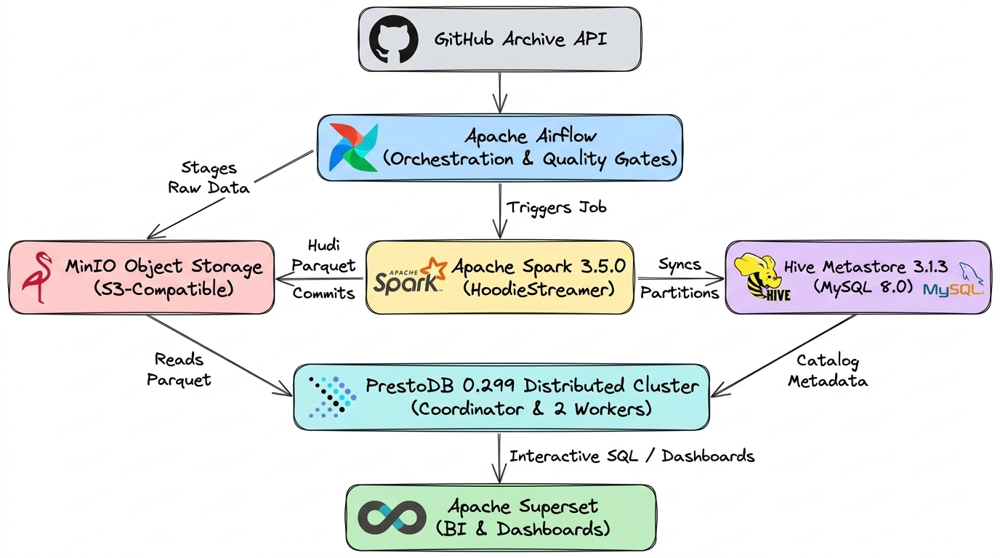

# GitHub Event Lakehouse: PrestoDB · Apache Hudi · MinIO · Airflow

A self-contained **data lakehouse** that runs entirely in Docker. It ingests the public
[GitHub Archive](https://www.gharchive.org/) event firehose into ACID-transactional
[Apache Hudi](https://hudi.apache.org/) tables on S3-compatible object storage, registers them in a
Hive Metastore, queries them with a distributed [PrestoDB](https://prestodb.io/) cluster, and
orchestrates the whole thing with [Apache Airflow](https://airflow.apache.org/) behind a
SQL-based data-quality gate.

<p align="center">
  
</p>

---

## Table of contents

- [Technology stack](#technology-stack)
- [What is Apache Hudi?](#what-is-apache-hudi)
- [Repository layout](#repository-layout)
- [File-by-file reference](#file-by-file-reference)
- [Schema management & evolution](#schema-management--evolution)
- [Quickstart](#quickstart)
- [Operating the platform](#operating-the-platform)
- [Design decisions explained](#design-decisions-explained)
- [Troubleshooting](#troubleshooting)

---

## Technology stack

| Layer | Technology | Version | Role |
| :--- | :--- | :--- | :--- |
| **Object storage** | [MinIO](https://min.io/) | `latest` | S3-compatible object store, run locally. Holds both the raw `.json.gz` staging area and the Hudi table files. Swappable for Backblaze B2 or AWS S3 via `.env` alone. |
| **Table format** | [Apache Hudi](https://hudi.apache.org/) | `0.15.0` | Adds ACID transactions, a commit timeline, record-level upserts/deletes, and inline clustering on top of Parquet files. Table type here is **Copy-on-Write**. |
| **Ingestion engine** | [Apache Spark](https://spark.apache.org/) | `3.5.0` | Hosts Hudi's `HoodieStreamer` utility, which reads JSON from object storage and writes Hudi tables. Runs in local mode. |
| **Metadata catalog** | [Apache Hive Metastore](https://hive.apache.org/) | `3.1.3` | Thrift metadata service backed by MySQL. Hudi syncs table and partition definitions here so Presto can discover them. |
| **Metastore database** | [MySQL](https://www.mysql.com/) | `8.0` | Relational backing store for the metastore's own schema (74 tables). |
| **Query engine** | [PrestoDB](https://prestodb.io/) | `0.299` | Distributed MPP SQL engine — one coordinator plus two workers, on OpenJDK 17. Reads Hudi tables through the metastore. **Read-only** for this connector. |
| **Orchestrator** | [Apache Airflow](https://airflow.apache.org/) | `2.7.2` (Python 3.9) | Schedules extraction, triggers the Spark job, runs the data-quality gate, and fires Slack alerts on failure. |
| **Visualisation** | [Apache Superset](https://superset.apache.org/) | `6.1.0` | Optional BI layer. Connects to Presto over the `pyhive` SQLAlchemy dialect. |

---

## What is Apache Hudi?

[Apache Hudi](https://hudi.apache.org/) (pronounced *"hoodie"*, originally created at Uber and an acronym for **H**adoop **U**pserts **D**eletes and **I**ncrementals) is an open-source **transactional data lakehouse table format**. It manages how data files (specifically [Apache Parquet](https://parquet.apache.org/)) are stored, mutated, and cataloged on distributed object storage such as AWS S3 or MinIO.

### The problem Hudi solves

In traditional data lakes, cloud storage stores raw, immutable flat files. That creates fundamental data engineering challenges:

- **No row-level updates or deletes:** Updating or deleting a single record requires reading, rewriting, and replacing an entire partition directory or table.
- **No transactional guarantees (ACID):** Concurrent writes risk corrupting readers, and failed pipeline runs leave uncommitted, orphaned files scattered across storage.
- **Costly privacy compliance:** Fulfilling GDPR/CCPA "Right to be Forgotten" requests requires expensive full-table rewrites.
- **The small-file problem:** Frequent batch or streaming ingestion creates millions of tiny Parquet files that overwhelm object store metadata and degrade SQL query performance.

Hudi bridges the gap between traditional data warehouses (fast updates, ACID guarantees) and cloud data lakes (cheap, scalable, open file formats) to create a **Lakehouse**.

### Core concepts in this project

| Concept | What it means | How this repository uses it |
| :--- | :--- | :--- |
| **ACID Transactions** | Atomic commits; writes succeed completely or rollback cleanly with zero reader interference. | Every batch ingested by `HoodieStreamer` commits atomically to MinIO. |
| **Record Key (`recordkey.field`)** | A unique primary key per record. | Mapped to `id` (the GitHub event ID). |
| **Precombine Key (`precombine.field`)** | An ordering field used to resolve conflicts when duplicate primary keys arrive. | Mapped to `created_at`. If two events share the same `id`, the record with the newer timestamp automatically wins. |
| **Commit Timeline (`.hoodie/`)** | An immutable transaction log tracking all commits, cleans, compactions, and rollbacks. | Stored alongside Parquet files in MinIO. Powers **time travel** and snapshot isolation for Presto queries. |
| **Table Type: Copy-on-Write (COW)** | Updates rewrite only the specific Parquet files containing modified rows. | Zero merge overhead for readers — Presto queries run against pure columnar Parquet at maximum speed. |
| **Hive-Style Partitioning** | Directories formatted as `key=value/`. | Events partition into `type=PushEvent/`, `type=PullRequestEvent/`, etc., allowing Presto to prune unused partitions instantly. |
| **Inline Clustering & Cleaning** | Automatically combines small files into optimal chunks and purges obsolete file slices. | Keeps 5 commits of history for time travel and clusters files every 4 commits without running background daemons. |

---

## Repository layout

```text
presto-hudi-cos/
├── README.md                             # This document
├── .env.example                          # Template for the 11 required environment variables
├── .env                                  # Your real values (git-ignored)
├── .gitignore                            # Excludes secrets, JARs (except the JDBC driver), caches, OS cruft
├── docker-compose.yml                    # Defines all 10 services, 6 volumes, and 1 network
│
├── images/
│   └── lakehouse_architecture.png        # Architecture diagram used above
│
├── airflow/
│   └── dags/
│       └── github_ingestion_dag.py       # The only DAG: 3 tasks + failure-alert callback
│
├── metastore/
│   ├── metastore-site.xml                # hive-site.xml TEMPLATE (contains {{PLACEHOLDER}} tokens)
│   └── lib/
│       └── mysql-connector-j-8.0.33.jar  # MySQL JDBC driver — the Hive image ships none
│
├── presto/
│   ├── coordinator/
│   │   ├── config.properties             # coordinator=true, discovery server, cluster memory cap
│   │   ├── jvm.config                    # -Xmx3G + 17 JDK-17 --add-opens flags
│   │   ├── node.properties               # node.environment / node.id / node.data-dir
│   │   └── catalog/hudi.properties       # Hudi connector + metastore URI
│   ├── worker-1/                         # Same four files; coordinator=false
│   └── worker-2/                         # Byte-identical to worker-1 except node.id
│
└── spark/
    ├── spark-defaults.conf               # Kryo serializer, Hive catalog, S3A connector, event logs
    ├── github-ingest.properties          # 18 HoodieStreamer table, sync, and clustering properties
    ├── github-schema.avsc                # Avro schema contract (8 top-level fields, nested payload)
    └── hudi_acid_superpowers_demo.py     # Standalone PySpark demo: upserts, GDPR deletes, time travel
```

---

## File-by-file reference

This guide provides a comprehensive technical breakdown of every repository file, organized by architectural layer. Each entry details the file's primary responsibility, key configuration parameters, and runtime behavior across the lakehouse stack.

---

### 1. Infrastructure & Orchestration

#### `docker-compose.yml`
* **Core Role:** The single source of truth for the local environment, defining all 10 container services, 6 persistent volumes, and 1 isolated bridge network (`lakehouse-network`).
* **Key Architecture Patterns:**
  * **Health-Gated Startup Sequences:** Instead of unreliable fixed startup delays, dependent containers declare explicit `condition: service_healthy` checks. For example, the Hive Metastore waits for MySQL to accept TCP connections, Presto waits for the Hive Metastore Thrift port, and Airflow waits for `minio-init` to exit with code `0`.
  * **Decoupled Dynamic Configuration:** Several container images require parameters populated from `.env`. Container entrypoints interpolate live environment variables into runtime configuration paths (such as `/tmp/etc` in Presto and `/opt/hive/conf` in Hive Metastore) on boot, preventing hardcoded credentials in tracked files.
  * **Reusable YAML Anchors:** The `x-presto-entrypoint: &presto-entrypoint` anchor defines Presto's entrypoint script once at the file root and injects it across `presto-server`, `presto-worker-1`, and `presto-worker-2`.
  * **State Persistence:** Dedicated Docker volumes (`minio-data`, `mysql-data`, `airflow-data`, `airflow-logs`, `spark-ivy-cache`, `superset-data`) ensure that raw objects, metadata schemas, DAG run histories, task execution logs, resolved Ivy dependencies, and dashboards survive container restarts.

#### `.env.example` / `.env`
* **Core Role:** Centralized configuration management defining the 11 environment variables shared across all 10 services.
* **Key Variable Groups:**
  * **Object Storage & S3:** `S3_ENDPOINT` (`http://minio:9000`), `S3_BUCKET_NAME` (`github-raw-data`), `AWS_ACCESS_KEY_ID`, `AWS_SECRET_ACCESS_KEY`, `AWS_REGION` (`us-east-1`), `S3_PATH_STYLE_ACCESS` (`true`), `S3_SSL_ENABLED` (`false`).
  * **Metastore Database:** `MYSQL_ROOT_PASSWORD` (`rootpassword`), `MYSQL_PASSWORD` (`hivepassword`).
  * **Web UI Security:** `SUPERSET_SECRET_KEY` (used for session signing and CSRF tokens).
  * **Observability:** `SLACK_WEBHOOK_URL` (optional incoming webhook endpoint for pipeline failure alerts).
* **Operational Note:** `.env.example` is tracked in version control as a documented baseline. Copy it to `.env` (which is git-ignored) before initial deployment.
* **Cloud Portability:** To point the lakehouse to AWS S3 or Backblaze B2 instead of local MinIO, update `S3_ENDPOINT`, set `S3_PATH_STYLE_ACCESS=false`, and set `S3_SSL_ENABLED=true` in `.env` without changing any pipeline code (stop `minio` and `minio-init`; ensure the target bucket already exists remotely).

---

### 2. Pipeline Workflow (`airflow/`)

#### `airflow/dags/github_ingestion_dag.py`
* **Core Role:** The primary workflow definition. Schedules and orchestrates the daily batch ingestion pipeline (`github_events_ingestion`) across 3 linear tasks with automated retries (`retries: 1`, `retry_delay: 5m`) and failure alert callbacks.

* **Detailed Task Breakdown:**

  1. **`download_and_upload_raw_data` (Task 1):**
     * **Execution Logic:** Computes a 3-hour lag window (`base_time = utcnow() - 3 hours`) and iterates backwards through 24 hourly increments to generate unpadded filenames (`YYYY-MM-DD-H.json.gz`). The 3-hour safety buffer avoids HTTP 404 errors caused by GitHub Archive publishing delays.
     * **Staging Mechanism:** Streams each hourly archive directly from `data.gharchive.org` to local temporary storage, validates that the downloaded archive exceeds 1 KB (discarding empty files), uploads the payload to `s3://$S3_BUCKET_NAME/github-raw/` using `boto3` path-style addressing, and purges the local temporary file.
     * **Fault Tolerance:** Logs warnings for individual missing hours without halting the run; raises an exception only if all 24 hourly downloads fail.

  2. **`trigger_hudi_ingestion` (Task 2):**
     * **Execution Logic:** Connects to the host Docker daemon over `/var/run/docker.sock` via `docker.from_env()` to run `spark-submit` inside the active `spark-client` container.
     * **Job Parameters:** Invokes `org.apache.hudi.utilities.streamer.HoodieStreamer` configured with `--master local[4]`, `--driver-memory 6G`, and `--table-type COPY_ON_WRITE`.
     * **Ingestion Flags:** Reads newline-delimited JSON files via `JsonDFSSource` from `s3a://$S3_BUCKET_NAME/github-raw/`, reconciles fields with `spark/github-schema.avsc`, writes Hudi Parquet files to `s3a://$S3_BUCKET_NAME/hudi-tables/github_events`, and synchronizes table partitions into the Hive Metastore (`--enable-hive-sync`).
     * **Circuit Breaker:** Streams Spark execution logs in real-time. If Hudi reports `"Nothing to commit"`, the task raises an explicit `RuntimeError` to prevent false-positive pipeline successes when zero new records were ingested.

  3. **`run_data_quality_assertions` (Task 3):**
     * **Execution Logic:** Connects to the Presto coordinator over PyHive DB-API (`port 8080`) and determines the newest batch commit timestamp using `SELECT max(_hoodie_commit_time) FROM hudi.default.github_events`.
     * **Validation Assertions:** Evaluates 5 SQL validation rules strictly scoped to that latest commit instant:
       * *Batch Volume Check:* Validates that `count(*)` in the batch is greater than 0.
       * *Primary Key Completeness:* Confirms zero records contain `id IS NULL OR trim(id) = ''`.
       * *Deduplication Invariant:* Validates that `count(id) - count(DISTINCT id) == 0` (verifying Hudi's upsert deduplication).
       * *Temporal Freshness:* Ensures the batch `created_at` timestamp falls within the last 24 hours.
       * *Partition Diversity:* Verifies that at least 2 distinct `type` event partitions were processed in the commit.

  4. **`pipeline_failure_alert` (On-Failure Callback):**
     * **Execution Logic:** Fires automatically if any task encounters an unhandled exception. Assembles execution context (DAG ID, task name, execution date, error trace, log URL) into a structured JSON payload and issues an HTTP POST to `SLACK_WEBHOOK_URL` if configured.
     * **Resilience:** Wrapped in try/except blocks to ensure webhook network issues cannot mask underlying pipeline execution states.

---

### 3. Metadata Catalog (`metastore/`)

#### `metastore/metastore-site.xml`
* **Core Role:** Configuration template for the Apache Hive Metastore service, defining the backing relational database connection, network listener properties, and S3A filesystem credentials.
* **Key Configuration Parameters:**
  | Property | Configured Value | Technical Rationale |
  | :--- | :--- | :--- |
  | `javax.jdo.option.ConnectionURL` | `jdbc:mysql://mysql-db:3306/metastore_db?...` | Connects the DataNucleus ORM layer to the MySQL database with SSL disabled. |
  | `javax.jdo.option.ConnectionDriverName` | `com.mysql.cj.jdbc.Driver` | Loads the MySQL Connector/J driver class. |
  | `javax.jdo.option.ConnectionUserName` | `hive` | MySQL database user for Metastore schema access. |
  | `hive.metastore.uris` | `thrift://hive-metastore:9083` | Exposes the Thrift RPC service used by Spark, Hudi, and Presto to discover table schemas and partitions. |
  | `hive.metastore.schema.verification` | `false` | Disables strict version checks to avoid startup failures on minor Metastore schema version mismatches. |
  | `fs.s3a.endpoint` | `{{S3_ENDPOINT}}` | Interpolated at startup to point S3A filesystem operations to MinIO (`http://minio:9000`). |
  | `fs.s3a.path.style.access` | `{{S3_PATH_STYLE_ACCESS}}` | Set to `true` to enforce path-style bucket addressing (`endpoint/bucket/`) required by MinIO. |
  | `fs.s3a.connection.ssl.enabled` | `{{S3_SSL_ENABLED}}` | Set to `false` for internal plain HTTP communication. |
  | `fs.s3a.aws.credentials.provider` | `com.amazonaws.auth.EnvironmentVariableCredentialsProvider` | Automatically resolves AWS keys from container environment variables. |
* **Runtime Initialization:** On boot, the container entrypoint substitutes placeholder tokens (`{{...}}`) with active `.env` values, saves the file to `/opt/hive/conf/hive-site.xml`, and creates a symlink to `/opt/hadoop/etc/hadoop/core-site.xml` so Hadoop's internal S3A client shares the identical endpoint settings. It then executes an idempotent schema check (`schematool -dbType mysql -info || schematool -dbType mysql -initSchema`) to initialize the 74 Metastore tables on fresh volumes.

#### `metastore/lib/mysql-connector-j-8.0.33.jar`
* **Core Role:** Official MySQL Connector/J JDBC driver enabling the Java-based Hive Metastore to connect to MySQL 8.0 over TCP.
* **Why It Exists:** Official `apache/hive:3.1.3` images do not bundle third-party database drivers due to licensing terms. Mounting this JAR into `/opt/hive/lib/` ensures the container can connect to MySQL immediately on launch without requiring runtime package downloads.

---

### 4. Distributed Query Engine (`presto/`)

#### `presto/*/config.properties`
* **Core Role:** Configures cluster topology, HTTP ports, memory allocations, and node discovery.
* **Coordinator vs. Worker Settings:**
  | Setting | Coordinator (`presto/coordinator/`) | Workers (`presto/worker-1/`, `worker-2/`) | Technical Rationale |
  | :--- | :--- | :--- | :--- |
  | `coordinator` | `true` | `false` | Designates the master node responsible for parsing SQL, generating distributed query plans, and scheduling tasks. |
  | `node-scheduler.include-coordinator` | `false` | *(Not applicable)* | Prevents query execution tasks from running on the coordinator, protecting it from worker OOM crashes. |
  | `discovery-server.enabled` | `true` | *(Not applicable)* | Runs the embedded discovery service so workers can register automatically. |
  | `discovery.uri` | `http://presto-server:8080` | `http://presto-server:8080` | Cluster registration endpoint. |
  | `query.max-memory` | `1.5GB` | *(Inherited)* | Total distributed memory ceiling across all nodes for any single query. |
  | `query.max-memory-per-node` | `1GB` | `1GB` | Maximum user memory allocated on any single node for query processing. |

#### `presto/*/jvm.config`
* **Core Role:** Sets JVM memory boundaries, garbage collection strategies, and JDK module reflection access.
* **Key Configuration Parameters:**
  * **Memory Boundaries:** Configured with `-server -Xmx3G` for a 3 GB maximum heap per container.
  * **Garbage Collection:** Employs `-XX:+UseG1GC` with `-XX:G1ReservePercent=15` to ensure consistent query latencies and avoid long GC pauses during distributed joins and aggregations.
  * **Fail-Fast Flags:** Includes `-XX:+ExitOnOutOfMemoryError` to trigger immediate process termination and container restart on heap exhaustion, preventing hung or degraded states.
  * **Java 17 Module Access:** Contains 17 explicit `--add-opens` directives (e.g., `--add-opens=java.base/java.nio=ALL-UNNAMED`, `--add-opens=java.base/java.lang.reflect=ALL-UNNAMED`). Since Java 17 strictly enforces module encapsulation, these flags permit Presto's off-heap memory allocators and internal reflection calls to operate without raising `InaccessibleObjectException`.

#### `presto/*/node.properties`
* **Core Role:** Establishes unique node identity, environment membership, and local storage directories.
* **Key Settings:**
  * `node.environment=test`: Cluster identifier. Every coordinator and worker node must share the identical environment string to join the cluster.
  * `node.id`: Unique identifier assigned to each node (`presto-coordinator-node-01`, `presto-worker-node-01`, `presto-worker-node-02`).
  * `node.data-dir=/var/presto/data`: Local directory for operational logs, temporary query spooling, and spill-to-disk operations.

#### `presto/*/catalog/hudi.properties`
* **Core Role:** Registers the `hudi` catalog in Presto, exposing Apache Hudi lakehouse tables as queryable SQL tables.
* **Key Settings:**
  * `connector.name=hudi`: Binds Presto's native Apache Hudi connector.
  * `hive.metastore.uri=thrift://hive-metastore:9083`: Points to the Hive Metastore to discover table schemas and partition boundaries.
* **Runtime Initialization:** Presto config mounts are read-only. At startup, the entrypoint script copies `/opt/presto-server/etc/` into an ephemeral `/tmp/etc` directory, dynamically appends S3 parameters (`hive.s3.endpoint`, `hive.s3.aws-access-key`, `hive.s3.aws-secret-key`, `hive.s3.path-style-access`, `hive.s3.ssl.enabled`) derived from `.env`, and launches Presto with `--etc-dir /tmp/etc`. This keeps active credentials out of tracked configuration files while ensuring Presto can access MinIO directly. Note that Presto's Hudi connector is read-only.

---

### 5. Ingestion & Storage Engine (`spark/`)

#### `spark/spark-defaults.conf`
* **Core Role:** Base configuration applied across all Spark applications initialized inside the `spark-client` container.
* **Key Configuration Parameters:**
  | Property | Configured Value | Technical Rationale |
  | :--- | :--- | :--- |
  | `spark.serializer` | `org.apache.spark.serializer.KryoSerializer` | High-efficiency binary serialization required by Hudi's index lookups and payload merging. |
  | `spark.sql.catalogImplementation` | `hive` | Connects Spark SQL directly to the Hive Metastore catalog. |
  | `spark.sql.hive.convertMetastoreParquet` | `false` | Disables Spark's default Parquet reader, forcing Spark to use Hudi's native input format so that commit timeline metadata and tombstone deletes are respected. |
  | `spark.hadoop.hive.metastore.uris` | `thrift://hive-metastore:9083` | Network location of the Hive Metastore Thrift listener. |
  | `spark.hadoop.fs.s3a.impl` | `org.apache.hadoop.fs.s3a.S3AFileSystem` | Binds Hadoop's S3A filesystem client for MinIO object access. |
  | `spark.hadoop.fs.s3a.aws.credentials.provider` | `com.amazonaws.auth.EnvironmentVariableCredentialsProvider` | Automatically extracts AWS credentials from container environment variables. |
  | `spark.jars.packages` | `org.apache.hudi:hudi-spark3.5-bundle_2.12:0.15.0, org.apache.hadoop:hadoop-aws:3.3.4` | Pre-packages Hudi lakehouse and AWS S3 connectors on session start. |
  | `spark.eventLog.enabled` | `true` | Records Spark application metrics to `/tmp/spark-events` for inspection in the Spark History Server. |

#### `spark/github-ingest.properties`
* **Core Role:** Supplies 18 operational table, index, sync, and lifecycle properties to `HoodieStreamer` via the `--props` CLI argument.
* **Key Property Groups:**
  * **Table Identity & Keys:**
    * `hoodie.datasource.write.recordkey.field=id`: Maps GitHub's unique event identifier as Hudi's record primary key.
    * `hoodie.datasource.write.precombine.field=created_at`: Conflict-resolution ordering field. If two incoming records share the same `id`, the record with the newer timestamp persists.
    * `hoodie.datasource.write.partitionpath.field=type`: Partitions Parquet files into directories based on event type.
    * `hoodie.datasource.write.hive_style_partitioning=true`: Writes directory paths using the standard `key=value/` format (`type=PushEvent/`), enabling Hive and Presto partition pruning.
  * **Metastore Synchronization:**
    * `hoodie.datasource.hive_sync.enable=true`: Automatically registers table metadata upon batch completion.
    * `hoodie.datasource.hive_sync.mode=hms`: Synchronizes metadata directly over Thrift to the Hive Metastore (`thrift://hive-metastore:9083`) without requiring an intermediate HiveServer2 JDBC connection.
    * `hoodie.datasource.hive_sync.database=default` & `.table=github_events`: Sets the destination schema and table name.
  * **Schema Handling:**
    * `hoodie.schema.on.read.enable=true` & `hoodie.datasource.write.reconcile.schema=true`: Enables dynamic schema evolution, allowing the table to accept additive non-breaking fields and nullable types without rewriting existing Parquet data files.
  * **File Lifecycle & Compaction:**
    * `hoodie.cleaner.commits.retained=5`: Retains the latest 5 commits in the timeline, supporting historical time-travel queries while automatically purging older file versions.
    * `hoodie.clustering.inline=true` & `hoodie.clustering.inline.max.commits=4`: Runs inline clustering every 4 commits, combining small Parquet files into optimal 120 MB columnar chunks without needing external compaction daemons.
  * **Schema Provider:**
    * `hoodie.streamer.schemaprovider.class=org.apache.hudi.utilities.schema.FilebasedSchemaProvider`: Instructs `HoodieStreamer` to load the Avro contract from `/opt/spark/conf/github-schema.avsc`.

#### `spark/github-schema.avsc`
* **Core Role:** The formal Apache Avro schema contract governing record ingestion into the lakehouse table.
* **Structural Architecture:**
  * **8 Top-Level Envelope Fields:** Matches the GitHub Archive event envelope: `id` (string), `type` (string), `public` (boolean), `created_at` (string), and four record objects: `actor` (6 fields), `repo` (3 fields), `org` (5 fields), and `payload` (15 fields).
  * **15-Field Payload Structure:** Holds 11 scalar fields (`action`, `ref`, `ref_type`, `master_branch`, `description`, `pusher_type`, `push_id`, `head`, `before`, `number`, `repository_id`) and 4 nested records (`issue`, `pull_request`, `comment`, `release`).
  * **Polymorphic Nullability:** Every field is defined as a union with null (e.g., `["null", "string"]` with `"default": null`). This accommodates GitHub's polymorphic event structures (e.g., a `PushEvent` provides `push_id` and commit references, whereas an `IssuesEvent` provides `action` and issue records) without triggering schema validation errors.

#### `spark/hudi_acid_superpowers_demo.py`
* **Core Role:** A standalone PySpark script mounted inside the `spark-client` container for demonstrating Hudi's core lakehouse capabilities.
* **Demonstrations Implemented:**
  1. **ACID Upsert (In-Place Mutation):** Selects an existing record from the table, modifies its `created_at` timestamp to the current instant, and writes an update batch using `operation='upsert'`. Proves that Hudi mutates existing Parquet files without duplicating rows or requiring full-table rewrites.
  2. **GDPR Point Delete ("Right to be Forgotten"):** Selects a specific `actor.login` and writes an `operation='delete'` batch targeting only that user's record keys. Demonstrates targeted compliance erasure on columnar object storage without rewriting unaffected partitions.
  3. **Time Travel & Timeline Inspection:** Queries the Hudi commit timeline (`_hoodie_commit_time`) to inspect historical table states across past commit instants, proving reproducible point-in-time analytical historical querying.

---

## Schema management & evolution

This lakehouse enforces a **contract-driven schema** using Apache Avro (`spark/github-schema.avsc`) and Hudi's `FilebasedSchemaProvider`.

---

### How schema enforcement works

1. **Explicit Schema Contract:** Every incoming JSON event from GitHub Archive is mapped onto `github-schema.avsc`. Any raw JSON fields not defined in this Avro schema are safely filtered out during ingestion.
2. **Table-Level Evolution:** When new columns are added to the Avro schema, Hudi's `hoodie.schema.on.read.enable=true` and `hoodie.datasource.write.reconcile.schema=true` automatically reconcile incoming batches against historical commits. Older files return `NULL` for newly added fields without requiring table rewrites.

---

### Schema change compatibility matrix

| Change Type | Example | In-Place Evolution? | Action Required |
| :--- | :--- | :---: | :--- |
| **Add nullable field** | Adding a new field to `payload` (e.g. `reactions`) | **Yes (Safe)** | Add the field to `github-schema.avsc` with `default: null`. Next DAG run applies it automatically. |
| **Widen data type** | Promoting `int` to `long` | **Yes (Safe)** | Update type in `github-schema.avsc`. Hudi reconciles the promotion on read. |
| **Incompatible change** | Renaming/deleting fields, changing `struct` to `string` | **No (Breaking)** | Hive Metastore rejects incompatible types to protect catalog integrity. Requires a table recreation. |

---

### Applying breaking (incompatible) schema changes

If you make a breaking schema change (such as altering nested struct hierarchies or removing existing columns), recreate the table definition using this 3-step workflow:

#### Step 1: Drop the catalog registration in Spark SQL
The table is registered as `EXTERNAL`, so dropping it removes only the Hive catalog entry — raw data files remain safe:
```bash
docker exec spark-client /opt/spark/bin/spark-sql \
  --master "local[2]" --driver-memory 1G \
  -e "DROP TABLE IF EXISTS default.github_events;"
```
*(Use `spark-sql` rather than `presto-cli`, as the Presto Hudi connector is read-only).*

#### Step 2: Delete existing Hudi storage files
In the **[MinIO Console](http://localhost:9001)** (`minioadmin` / `minioadmin`), navigate to the `github-raw-data` bucket and delete the `hudi-tables/` prefix. This purges old Parquet files and resets Hudi's commit checkpoint.

#### Step 3: Re-trigger the ingestion DAG
In the **[Airflow UI](http://localhost:8085)** (`admin` / `admin`), click **▶ Trigger DAG** on `github_events_ingestion` (or run `docker exec airflow airflow dags trigger github_events_ingestion`). Spark will ingest the raw staging data under your new schema and register fresh table metadata in the Hive Metastore.

---

## Quickstart

Get the entire lakehouse platform up and running in under 5 minutes.

---

### Prerequisites

* **Docker & Docker Compose:** Docker Engine 24.0+ and Docker Compose 2.20+
* **Memory Allocation:** At least **16 GB RAM** allocated to Docker (Docker Desktop → Settings → Resources → Memory)
* **Disk Space:** ~10 GB free disk space for images and local data

---

### 1. Configure environment

Copy the pre-configured environment template:

```bash
cp .env.example .env
```
*(Default values work out-of-the-box for local MinIO object storage. Optionally set `SLACK_WEBHOOK_URL` for alerts).*

---

### 2. Start the platform

Launch all 10 services in the background:

```bash
docker compose up -d
```

> **Note:** Initial startup downloads container images (~6 GB) and pre-warms Hudi's dependency cache. Allow 2–3 minutes for all containers to reach a healthy state.

---

### 3. Verify & access web interfaces

Confirm container health:

```bash
docker compose ps
```
*(All core services will report `healthy` or `running`. The helper `minio-init` container will show `Exited (0)`, which is expected).*

Once services are healthy, access the web interfaces directly in your browser:

| Service / Interface | URL | Credentials | Purpose |
| :--- | :--- | :--- | :--- |
| **Airflow Webserver** | [http://localhost:8085](http://localhost:8085) | `admin` / `admin` | Trigger and monitor ingestion DAG runs |
| **MinIO Console** | [http://localhost:9001](http://localhost:9001) | `minioadmin` / `minioadmin` | Inspect raw staging bucket and Hudi table files |
| **Apache Superset** | [http://localhost:8088](http://localhost:8088) | `admin` / `admin` | SQL Lab queries, metrics, and BI dashboards |
| **Spark History Server** | [http://localhost:18080](http://localhost:18080) | *(No auth)* | Review completed Spark `HoodieStreamer` job runs |
| **Presto Coordinator** | [http://localhost:8080](http://localhost:8080) | *(No auth)* | Cluster status, active queries, and worker nodes |

👉 Next step: Proceed to **[Operating the platform](#operating-the-platform)** to trigger your first ingestion run.

---

## Operating the platform

A complete step-by-step workflow: from triggering ingestion and running interactive SQL queries, to demonstrating Hudi's ACID superpowers and building dashboards.

---

### 1. Ingest data via Airflow

Trigger the automated 3-task pipeline (`download → ingest → quality gate`):

1. Open the **[Airflow Web UI](http://localhost:8085)** in your browser (`admin` / `admin`).
2. Toggle the `github_events_ingestion` DAG to **Active** (unpause).
3. Click **▶ Trigger DAG** (under the Actions column) to initiate execution.

*(CLI alternative: `docker exec airflow airflow dags unpause github_events_ingestion && docker exec airflow airflow dags trigger github_events_ingestion`)*

* **Real-Time Pipeline Progress:** Monitor the Grid and Graph views live at [http://localhost:8085](http://localhost:8085).
* **Spark Live Progress:** While Task 2 (`trigger_hudi_ingestion`) runs, monitor active tasks, stages, and storage at [http://localhost:4040](http://localhost:4040).
* **Spark History Server:** Review completed job metrics and execution timelines at [http://localhost:18080](http://localhost:18080).

> **Runtime note:** A full 24-hour batch processes ~1.5 million GitHub events across 16 event-type partitions. Downloading raw archives from GitHub dominates the runtime.

---

### 2. Query the lakehouse with Presto

You can run interactive SQL queries against the lakehouse either directly in your browser using **Apache Superset SQL Lab** or via the **Presto CLI** in your terminal:

* **Option A: Apache Superset SQL Lab (Web UI — Recommended):**
  Open **[http://localhost:8088](http://localhost:8088)** (`admin` / `admin`) → navigate to **SQL Lab** → **SQL Editor** → select Database: `Presto`, Schema: `default`.
* **Option B: Presto CLI (Terminal):**
  ```bash
  docker exec -it presto-server presto-cli --catalog hudi --schema default
  ```

#### A. Discover tables & partition distribution
```sql
SHOW TABLES;

-- Event volume by partition (demonstrating partition pruning)
SELECT type, count(*) AS events
FROM github_events
GROUP BY type
ORDER BY events DESC;
```

#### B. Query deep nested JSON / Avro structures
Because the table is backed by a strongly-typed Avro schema, nested attributes query with standard SQL dot-notation:

```sql
-- Extract git commit details from push events
SELECT payload.push_id, payload.ref, payload.head
FROM github_events
WHERE type = 'PushEvent'
LIMIT 5;

-- Extract source and target branches from pull requests
SELECT payload.pull_request.number,
       payload.pull_request.head.ref AS source_branch,
       payload.pull_request.base.ref AS target_branch
FROM github_events
WHERE type = 'PullRequestEvent'
LIMIT 5;
```

#### C. Inspect Hudi's ACID commit timeline
Query Hudi's internal metadata column `_hoodie_commit_time` to inspect historical write batches:

```sql
SELECT _hoodie_commit_time, count(*) AS rows
FROM github_events
GROUP BY _hoodie_commit_time
ORDER BY _hoodie_commit_time DESC;
```

> **Note:** The Presto Hudi connector is **read-only** (`SELECT` queries only). DDL/DML write operations (`INSERT`, `UPDATE`, `DROP`) are managed via Apache Spark.

---

### 3. Run the Hudi ACID superpowers demo

Run the bundled PySpark demonstration script to witness Hudi's lakehouse capabilities in action:

```bash
docker exec -it spark-client /opt/spark/bin/spark-submit \
  --master "local[4]" --driver-memory 2G \
  /opt/spark/hudi_acid_superpowers_demo.py
```

*(Prerequisite: Requires at least one completed ingestion DAG run).*

This interactive script executes three live demonstrations:
1. **ACID In-Place Upsert:** Selects an existing Issue or PR event and updates its timestamp. The record mutates in-place on storage without creating duplicates or requiring a full table rewrite.
2. **GDPR Point Delete ("Right to be Forgotten"):** Selects an active user login and permanently purges all associated activity records by primary key without rewriting unaffected files.
3. **Time Travel Inspection:** Reads Hudi's `.hoodie/` timeline to list active commit instants and display data states across historical points in time.

---

### 4. Visualize data in Apache Superset

Connect Superset to Presto to create charts and dashboards:

1. Open **[http://localhost:8088](http://localhost:8088)** in your browser (`admin` / `admin`).
2. Navigate to **Settings** (top right) → **Database Connections** → **+ Database**.
3. Select **Presto** from the database dropdown.
4. Enter the internal Docker SQLAlchemy URI:
   ```text
   presto://superset@presto-server:8080/hudi/default
   ```
5. Click **Test connection** (expect a green success message), then click **Connect**.
6. Open **SQL Lab → SQL Editor**, select the `hudi` catalog and `default` schema, and start querying.

---

## Design decisions explained

The engineering rationale, trade-offs, and production context behind key architectural choices.

---

### Why `local[4]` and 6 GB of driver memory?

* **The Decision:** Run Spark with `--master local[4]` and `--driver-memory 6G` rather than default `--master local[*]`.
* **The Problem:** GitHub Archive files are `.json.gz` (compressed gzip). Gzip files are **non-splittable** — each file must be decompressed as a single stream, inflating roughly **10x in RAM**. On a modern 8- or 12-core machine, default Spark (`local[*]`) attempts to decompress 8 to 12 files simultaneously in a single JVM, causing immediate `OutOfMemoryError: Java heap space`.
* **Why this works:** Capping concurrency at 4 (`local[4]`) limits simultaneous file inflations to 4 at a time, while 6 GB provides ample heap headroom for Hudi's sorting and indexing.
* **Key Takeaway:** In Spark local mode, there are no worker executors. All tasks run inside the driver JVM, meaning only `--driver-memory` has an effect (`--executor-memory` is ignored).

---

### Why Copy-on-Write rather than Merge-on-Read?

* **The Decision:** Configure Hudi as `COPY_ON_WRITE` (`--table-type COPY_ON_WRITE`).
* **The Trade-off:**
  | Table Type | Write Speed | Query / Read Speed | Ideal Workload |
  | :--- | :--- | :--- | :--- |
  | **Copy-on-Write (COW)** *(Chosen)* | Slower (rewrites Parquet files on update) | **Fastest** (pure columnar Parquet reads) | Analytical queries, BI dashboards, batch jobs |
  | **Merge-on-Read (MOR)** | Fastest (appends updates to delta Avro logs) | Slower (readers must merge base + delta files) | High-frequency streaming / real-time CDC |
* **Why this works:** This pipeline ingests in hourly/daily batches and serves interactive SQL queries to Presto and Superset. Optimizing for **blazing-fast read speed** is far more valuable than write latency. Presto queries plain Parquet files directly with zero merge overhead.

---

### Why partition by `type`?

* **The Decision:** Store events in directories partitioned by event type (`type=PushEvent/`, `type=PullRequestEvent/`).
* **Why this works:** It makes **partition pruning** easy to demonstrate in SQL. When a query includes `WHERE type = 'PushEvent'`, Presto skips all other partition folders and only reads the relevant Parquet files.
* **Production Reality:** In real-world enterprise deployments, event data is almost always partitioned by **ingestion date** (`year=.../month=.../day=...`). GitHub events are heavily skewed — `PushEvent` accounts for ~85% of all events, creating uneven partition sizes. Date partitioning guarantees evenly distributed file sizes across object storage.

---

### Why does Airflow use the Docker socket instead of a Spark operator?

* **The Decision:** Airflow mounts `/var/run/docker.sock` and triggers `spark-submit` inside the `spark-client` container via `docker exec`.
* **The Problem:** Using Airflow's built-in `SparkSubmitOperator` requires bundling Java, Spark binaries, and ~150 MB of Hudi/Hadoop JAR dependencies directly into the Airflow container image.
* **Why this works:** Keeping Spark dependencies isolated inside `spark-client` keeps Airflow lightweight, fast to boot, and free of Java/Hadoop library conflicts.
* **Production Note:** Mounting the Docker socket grants host-level container control to Airflow. This is safe and convenient for local development, but in a production cloud environment, you would use a remote API such as Apache Livy or the Kubernetes Spark Operator.

---

### Why is there a "Nothing to commit" circuit breaker?

* **The Decision:** Fail the ingestion task if Spark output contains `"Nothing to commit"`.
* **The Problem:** If no new raw files exist on MinIO (or if a previous run already consumed them), Hudi exits with code `0` (Success) without writing any new rows.
* **Why this works:** Without this check, Airflow would see exit code `0`, mark the task **green**, and proceed to validate stale data from a previous commit. The circuit breaker catches this silent false-success and raises an alert.

---

## Troubleshooting

Common issues, root causes, and step-by-step resolutions.

### 1. Containers & Startup

#### `minio-init` container status is `Exited (0)`
* **Explanation:** Normal behaviour. `minio-init` is a one-shot setup container that creates the `github-raw-data` bucket on MinIO, prints a confirmation, and exits cleanly.
* **Verification:** Run `docker logs minio-init` to confirm `MinIO storage initialized successfully`.
* **Technical Note:** Airflow declares `depends_on: { minio-init: { condition: service_completed_successfully } }`, so it waits for this container to exit with code `0` before starting the scheduler.

#### Metastore fails with `Table 'metastore_db.DBS' doesn't exist`
* **Cause:** Hive Metastore started before its MySQL database finished creating the catalog tables.
* **Resolution:** Re-run the metastore's schema initialization tool:
  ```bash
  docker exec hive-metastore /opt/hive/bin/schematool -dbType mysql -initSchema
  ```
* **Technical Note:** The container entrypoint executes `schematool -dbType mysql -info || schematool -dbType mysql -initSchema`. If MySQL was interrupted during first initialization, triggering `schematool` manually restores the 74 metadata tables.


### 2. Ingestion & Pipeline Issues

#### Presto error: `Table hudi.default.github_events does not exist`
* **Cause:** The table has not been created yet because the Airflow pipeline has not run.
* **Resolution:** In the **[Airflow UI](http://localhost:8085)** (`admin` / `admin`), unpause `github_events_ingestion` and click **▶ Trigger DAG** (or run `docker exec airflow airflow dags trigger github_events_ingestion`).
* **Technical Note:** If the DAG reported success but the table is still missing, inspect the `trigger_hudi_ingestion` task logs for `"Nothing to commit"`. This indicates no raw `.json.gz` files were found in `s3://github-raw-data/github-raw/`.

#### Spark job fails with `OutOfMemoryError: Java heap space`
* **Cause:** Spark exceeded driver heap memory while extracting and parsing large compressed GitHub event files.
* **Resolution (choose one):**
  1. **Allocate more RAM (Recommended):** In Docker Desktop → Settings → Resources, allocate at least **16 GB** memory.
  2. **Reduce concurrency:** In `airflow/dags/github_ingestion_dag.py`, change `--master local[4]` to `--master local[2]` to cut concurrent partition inflation in half.
  3. **Lower batch limit:** In `airflow/dags/github_ingestion_dag.py`, reduce `--source-limit` to `268435456` (256 MB).
* **Technical Note:** GitHub Archive `.json.gz` files are non-splittable, so each file becomes one Spark partition. Local mode runs all tasks in a single driver JVM. You can inspect configured driver memory settings and environment properties at `http://localhost:18080` → application → **Environment**.

#### Airflow web UI lost previous DAG run history
* **Cause:** Running `docker compose down -v` deletes Docker storage volumes, including `airflow-data` where SQLite stores run history.
* **Resolution:** To stop containers without losing run history or ingested tables, run `docker compose down` (without the `-v` flag).


### 3. Querying & Storage

#### Presto error: `Hoodie table not found in path …/.hoodie`
* **Cause:** Hive Metastore remembers that the table exists, but the physical data files in MinIO storage were deleted.
* **Resolution:** Drop the orphaned catalog entry using Spark SQL, then re-run the pipeline:
  ```bash
  docker exec spark-client /opt/spark/bin/spark-sql \
    --master "local[2]" --driver-memory 1G \
    -e "DROP TABLE IF EXISTS default.github_events;"
  ```
* **Technical Note:** The table is an `EXTERNAL` table. Deleting storage files leaves the metastore out of sync. Because the Presto Hudi connector is read-only, `DROP TABLE` DDL must be submitted through Spark SQL.

#### Presto query fails with an S3 Authentication / Access Denied error
* **Cause:** Presto cannot communicate with MinIO storage, usually because `.env` was missing or modified after the container started.
* **Resolution:** Check that Presto received the active credentials:
  ```bash
  docker exec presto-server cat /tmp/etc/catalog/hudi.properties
  ```
  You should see `hive.s3.endpoint`, `hive.s3.aws-access-key`, and `hive.s3.aws-secret-key`. If missing, recreate the Presto cluster:
  ```bash
  docker compose restart presto-server presto-worker-1 presto-worker-2
  ```
* **Technical Note:** Presto's entrypoint dynamically copies read-only mounted files to `/tmp/etc` and appends `hive.s3.*` credentials from environment variables before launching.

### 4. Platform Resets

| Reset Type | Command / Action | What gets deleted | What is preserved |
| :--- | :--- | :--- | :--- |
| **Data-Only Reset** *(Recommended)* | 1. In [MinIO Console](http://localhost:9001), delete `hudi-tables/`<br>2. Run `DROP TABLE IF EXISTS default.github_events;` in Spark | Ingested Hudi tables and raw data batches | Docker images, Ivy JAR cache, Airflow DAG history |
| **Factory Reset** *(Clean Slate)* | `docker compose down -v`<br>`docker compose up -d` | **Everything** — all 6 volumes, tables, users, and logs | Nothing (fresh initial state) |
